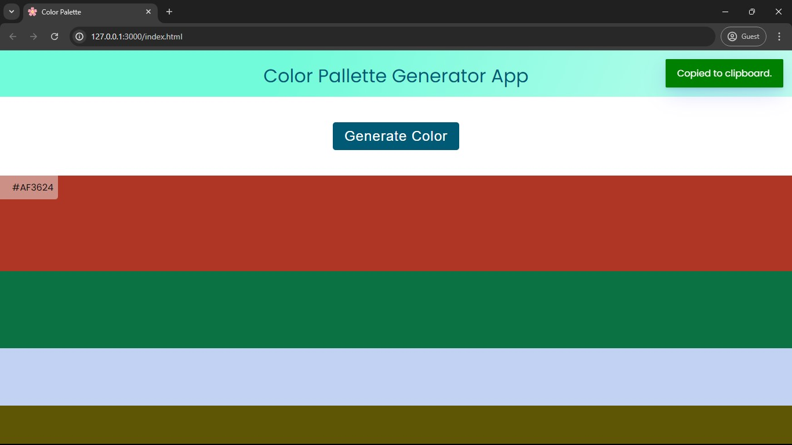

# Color Palette Generator

This project is a simple web application that generates a random color palette. Users can generate a new palette by clicking a button, and they can copy any color code to the clipboard by clicking on it.

## Table of Contents

- [Demo](#demo)
- [Features](#features)
- [Technologies](#technologies)
- [Installation](#installation)
- [Usage](#usage)
- [Acknowledgements](#acknowledgements)
## Demo




## Features

- Generate a random color palette with a single click
- Display hex codes for each color
- Click to copy hex code to the clipboard
- Responsive design


## Tech Stack

- HTML
- CSS
- JavaScript


## Installation

To get a local copy up and running follow these simple steps:

1. Clone the repo
   ```sh
   git clone https://github.com/aimless-coder/Colour_Pallette_Generator.git
   ```

2. Open `index.html` in your browser

    
## Usage

- Open the application in your web browser.
- Click the "Generate Color" button to create a new color palette.
- Click on any color code to copy it to your clipboard.


## Acknowledgements

 - [toastify-js](https://github.com/apvarun/toastify-js)


